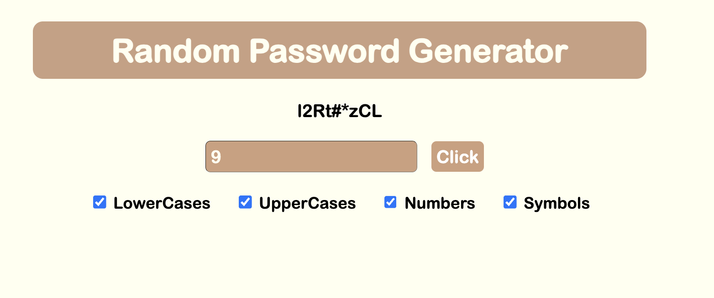

# Random Password Generator

A simple, clean, and easy-to-use web application for generating strong, random passwords. This tool allows users to specify the length and character types to be included in their new password, providing a quick and secure solution for password creation.




## Features

-   **Customizable Length:** Specify the exact length of the password you need.
-   **Character Set Selection:** Choose to include or exclude:
    -   Lowercase Letters (`a-z`)
    -   Uppercase Letters (`A-Z`)
    -   Numbers (`0-9`)
    -   Symbols (`!@#$%^&*()_+`)
-   **Instant Generation:** Passwords are generated instantly on a button click.
-   **Input Validation:** The application provides helpful feedback if the password length is invalid or if no character sets are selected.
-   **Clean User Interface:** A straightforward and intuitive interface built with HTML and CSS.

## Technologies Used

-   **HTML5:** For the structure and content of the web page.
-   **CSS3:** For styling and presentation.
-   **Vanilla JavaScript:** For the core password generation logic and DOM manipulation.

## Getting Started

No installation is required. This is a purely front-end project that runs in any modern web browser.

1.  **Download or Clone the Repository**

    ```bash
    git clone https://github.com/lee3291/random-password-generator.git
    ```

    (Or simply download the ZIP file containing `index.html`, `style.css`, and `index.js`)

2.  **Open the Application**

    Navigate to the project folder and open the `index.html` file in your favorite web browser (like Chrome, Firefox, or Edge).

3.  **Generate Your Password!**
    * Enter your desired password length.
    * Check the boxes for the character types you want to include.
    * Click the "Click" button to generate your new password.

## File Structure

The project is organized into three main files:

-   `index.html`: Contains the HTML structure of the password generator, including the input fields, checkboxes, and buttons.
-   `style.css`: Provides the styling rules to make the application visually appealing and user-friendly.
-   `index.js`: Houses the JavaScript logic responsible for generating the password based on user selections and updating the display.

## Future Improvements

While the current version is fully functional, here are some ideas for future enhancements:

-   [ ] **Copy to Clipboard Button:** A one-click button to easily copy the generated password.
-   [ ] **Password Strength Indicator:** A visual bar or text that assesses the strength of the generated password.
-   [ ] **Advanced Character Options:** Allow users to specify which symbols to include or exclude.

## License

This project is open-source and available under the [MIT License](LICENSE).

## Author

**[Ethan(Seokho) Lee]**

-   GitHub: [@lee3291](https://github.com/lee3291)
-   LinkedIn: [Ethan(Seokho) Lee](https://linkedin.com/in/ethanseokholee)
